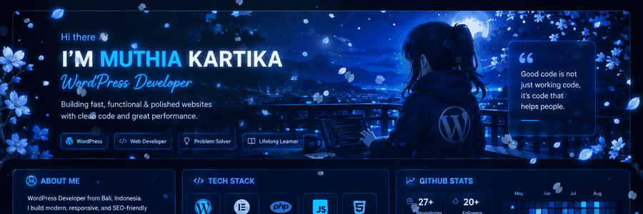
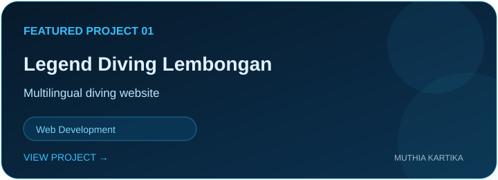
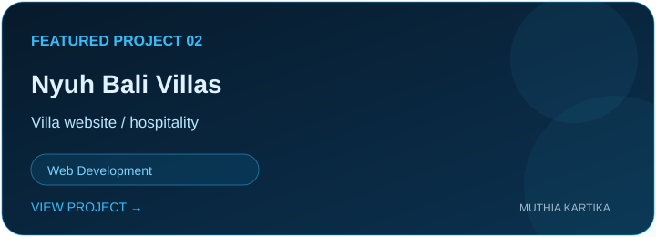
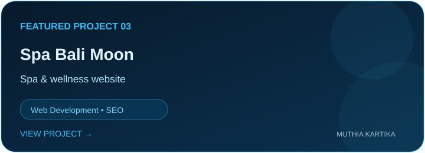
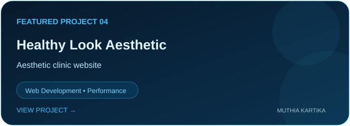

 

### 💙 Web Developer · Tech Enthusiast · Problem Solver

  <a href="https://github.com/Muthiakartika">GitHub</a> ·
  <a href="https://www.linkedin.com/in/muthiakartika">LinkedIn</a>

---

<table>
<tr>
<td width="36%" valign="top">

## ✦ ABOUT ME

**Hi, I'm Muthia!** 👋

I build modern, responsive and user-friendly websites, from **WordPress projects to Next.js applications**, with a focus on clean UI, performance and practical solutions.

### Currently into

- ⚡ Web development
- 🎨 UI, UX & visual design
- 🔧 Performance & SEO
- 🧩 WordPress & modern web apps
- 📚 Always exploring new tech

 

</td>

<td width="64%" valign="top">

## ⚡ GITHUB ACTIVITY

<table>
<tr>
<td align="center"><b>Repositories</b> ↗ GitHub</td>
<td align="center"><b>Contributions</b> ↗ GitHub</td>
<td align="center"><b>Projects</b> Web & WordPress</td>
</tr>
</table>

</td>
</tr>
</table>

---

## 🚀 FEATURED PROJECTS

<table>
<tr>
<td width="50%" valign="top">

</td>
<td width="50%" valign="top">

</td>
</tr>
<tr>
<td width="50%" valign="top">

</td>
<td width="50%" valign="top">

</td>
</tr>
</table>

---

<table>
<tr>
<td width="52%" valign="top">

## 💻 TECH I USE

</td>

<td width="48%" valign="top">

## 📊 GITHUB STATS

</td>
</tr>
</table>

---

## 🌊 TOP LANGUAGES

---

### ✨ Building things, one pixel at a time.

**Thanks for stopping by 💙**

